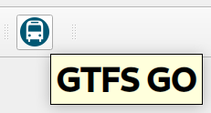
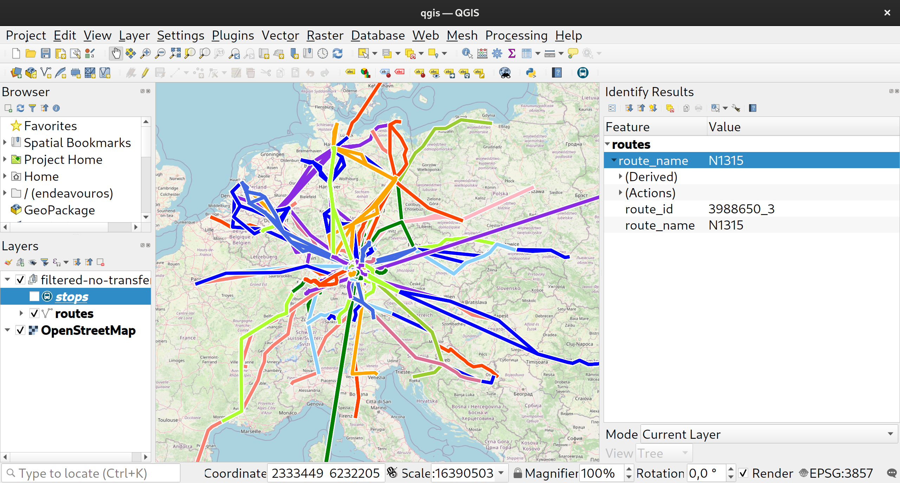

# Visualizing GTFS with QGIS

* https://nitter.privacy1st.de/thomasforth/status/1564683686330736646
* https://github.com/MIERUNE/GTFS-GO

## Installation

* Install QGIS
* Install `python-pandas`
* Install Arial font (`ttf-ms-fonts`)
* In QGIS, install the `GTFS-GO` plugin

## Example Project

* GTFS data from https://www.delfi.de/
* Filtered with https://github.com/ipeaGIT/gtfstools to bounding box (11.0 - 11.5, 49.0 - 49.5)
* Deleted `shapes.txt` as this file was invalid (https://github.com/ipeaGIT/gtfstools/issues/71)

In QGIS:

* Press the GTFS-GO Button 
  - The resulting `.geojson` files were stored inside [GTFS-GEOJSON](GTFS-GEOJSON)
- With the `Identify Features`-button, individual routes can be selected: 
- The resulting project was saved as [qgis.qgz](qgis.qgz)